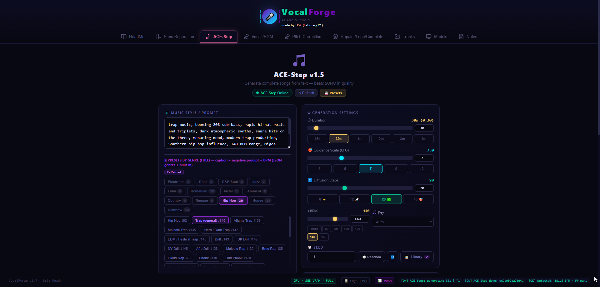

# 🎵 VocalForge v1.7

## Modular AI Audio Framework — Auto-Adaptive, Stable, Beta Ready

**VocalForge** is a complete AI music production application featuring:
- 🎤 **RVC Voice Conversion** (AI voice transformation)
- 🎵 **ACE-Step Music Generation** (Text-to-Music, Audio Cover)
- 🎚️ **Stem Separation** (Demucs)
- 🎹 **Repaint/Lego/Complete** (Audio editing)

---

## 🎬 Demo Video

### 🎵 VocalForge v1.7 - AI Music Generation & Audio Processing

**Watch the demo on YouTube:**

➡️ **[https://www.youtube.com/watch?v=8XSwCM7bM1A](https://www.youtube.com/watch?v=8XSwCM7bM1A)**

<p align="center">
  
</p>

---

## 🚧 Work in Progress (WIP)

The following features are currently under active development:

| Feature | Status | Notes |
|---|---|---|
| **Vocal Pitch Correction** | 🚧 Beta | Auto-tune style pitch correction with scale matching. Basic functionality works, fine-tuning in progress. |

> 💡 These features are functional but may produce inconsistent results. Feedback and testing are welcome!

---

## 📋 TODO - Planned Features

### 🔜 Coming Soon

| Feature | Priority | Description |
|---|---|---|
| **Vocal Separator** | 🔥 High | Upload full song and auto-separate vocals before RVC (Demucs already integrated!) |
| **Auto Final Mix** | 🔥 High | After RVC conversion, automatically mix converted vocal back with original instrumental |
| **Export Presets** | ⭐ Medium | Save favorite settings as presets (e.g., "Preset Kanye Sad", "Preset Florin Happy") |

### 💡 Future Ideas

- **Batch Processing** - Convert multiple vocals in one go
- **Real-time Preview** - Hear conversion before final render
- **Model Sharing** - Share custom RVC models with community
- **Cloud Storage** - Save tracks and presets to cloud

---

## 📝 Changelog (Latest Updates)

### v1.7 - Recent Changes

#### ✅ Added
- **RVC Voice Conversion** - Complete AI voice transformation feature
  - Support for custom RVC models (.pth files)
  - Pitch shifting and emotion control
  - Formant preservation
  - 4 pre-loaded models (Bad Bunny, Florin Salam, Justin Bieber, Kanye West)
- **Windows Terminal requirement** - Now required for multi-tab startup with colored tabs
- **Enhanced RVC UI** - Improved conversion interface with more options

#### ❌ Removed
- **Vocal2BGM** - Feature removed (transform vocal to full song)
- **Pitch Correction tab** - Deprecated in favor of RVC Voice Conversion

#### 🐛 Fixed
- **Unicode encoding errors** - Replaced Unicode characters (✓, ✗) with ASCII (OK, ERR) for Windows compatibility
- **RVC config path issues** - Fixed working directory changes for proper config loading
- **RVC argument parsing** - Fixed `parse_args([])` to ignore uvicorn command line arguments
- **RVC array bounds** - Added safety checks for `to_return_protect` arrays

#### 🔧 Technical Updates
- Added `backend/app.py` - Dedicated RVC API endpoint (port 8002)
- Added `backend/endpoints/rvc_conversion.py` - RVC conversion endpoint
- Added `core/modules/rvc_model.py` - RVC model wrapper
- Updated `START_ALL.bat` - Now launches 4 services (Frontend, Backend, ACE-Step, RVC)
- Updated `.gitignore` - Added RVCWebUI to ignored folders

---

## 🚀 Installation (Windows)

### Prerequisites

| Software | Version | Download |
|---|---|---|
| **Python** | 3.10 or 3.11 | https://www.python.org/downloads/ |
| **Node.js** | 18+ | https://nodejs.org/ |
| **Git** | Latest | https://git-scm.com/downloads |
| **Windows Terminal** | Latest | https://aka.ms/terminal (Microsoft Store) |
| **CUDA** (optional) | 11.8 or 12.1 | https://developer.nvidia.com/cuda-downloads |

> ⚠️ **Important for Python installation:**
> - Check ✅ **"Add Python to PATH"** during installation
> - Verify installation: Open CMD and type `python --version`

> 💡 **Windows Terminal is required** for running multiple services simultaneously with colored tabs.

---

### Step 1: Clone Repository

```bash
git clone https://github.com/iulicafarafrica/VocalForge.git
cd VocalForge
```

---

### Step 2: Install Python Dependencies

**Option A: Automatic (Recommended)**
```bash
# Double-click or run:
setup.bat
```

**Option B: Manual Installation**

```bash
# 1. Create virtual environment
python -m venv venv

# 2. Activate virtual environment
venv\Scripts\activate

# 3. Install PyTorch with CUDA support (for NVIDIA GPU)
# For CUDA 12.1 (RTX 3070, 4070, etc.)
pip install torch torchvision torchaudio --index-url https://download.pytorch.org/whl/cu121

# For CUDA 11.8 (older GPUs)
# pip install torch torchvision torchaudio --index-url https://download.pytorch.org/whl/cu118

# For CPU only (no GPU)
# pip install torch torchvision torchaudio

# 4. Install other Python dependencies
pip install -r requirements.txt
```

**requirements.txt contents:**
```
fastapi>=0.110.0
uvicorn[standard]>=0.27.0
python-multipart>=0.0.9
python-dotenv>=1.0.0
httpx>=0.24.0
librosa>=0.10.0
soundfile>=0.12.0
pydub>=0.25.0
numpy>=1.24.0
```

---

### Step 3: Install Frontend Dependencies

```bash
cd frontend
npm install
cd ..
```

**package.json dependencies:**
```json
{
  "dependencies": {
    "lucide-react": "^0.574.0",
    "react": "^18.2.0",
    "react-dom": "^18.2.0"
  },
  "devDependencies": {
    "@vitejs/plugin-react": "^4.2.0",
    "vite": "^5.0.0"
  }
}
```

---

### Step 4: Install ACE-Step (Music Generation)

ACE-Step is a separate service for AI music generation. It runs on port 8001.

```bash
# Navigate to ace-step directory (if you have it)
cd ace-step

# Install ACE-Step dependencies using uv
pip install uv
uv sync

# Or use the provided batch file
cd ..
fix_acestep_deps.bat
```

> 📝 **Note:** ACE-Step requires ~10GB disk space for models (downloaded on first run)

---

### Step 5: Verify Installation

```bash
# Check Python packages
python -c "import torch; print(f'PyTorch: {torch.__version__}')"
python -c "import librosa; print(f'Librosa: {librosa.__version__}')"
python -c "import fastapi; print(f'FastAPI: {fastapi.__version__}')"

# Check Node.js
npm --version

# Check GPU (if available)
python -c "import torch; print(f'CUDA: {torch.cuda.is_available()}')"
```

---

## ▶️ Running VocalForge

VocalForge uses **3 separate services** that run simultaneously:

| Service | Port | Description |
|---|---|---|
| **Backend API** | 8000 | FastAPI server (Demucs, RVC Voice Conversion) |
| **ACE-Step API** | 8001 | Music generation service |
| **Frontend UI** | 3000 | React web interface |

---

### Option A: Start All Services (Recommended)

**Using Windows Terminal (tabs):**
```bash
START_ALL.bat
```

**Manual (3 separate terminals):**

**Terminal 1 - Backend API:**
```bash
start_backend.bat
# Access: http://localhost:8000
# API Docs: http://localhost:8000/docs
```

**Terminal 2 - ACE-Step API:**
```bash
start_acestep.bat
# Access: http://localhost:8001
# API Docs: http://localhost:8001/docs
```

**Terminal 3 - Frontend UI:**
```bash
start_frontend.bat
# Access: http://localhost:3000
```

---

### Option B: Development Mode

**Backend (with auto-reload):**
```bash
cd backend
uvicorn main:app --reload --host 0.0.0.0 --port 8000
```

**Frontend (with hot-reload):**
```bash
cd frontend
npm run dev
```

---

### Stopping Services

**Graceful shutdown:**
- Press `Ctrl+C` in each terminal
- Or close the terminal windows

**Force kill all Python processes:**
```bash
taskkill /F /IM python.exe
```

---

## 🎵 Features & Usage

### 1. Vocal Pitch Correction (Auto-Tune)

**Purpose:** Correct vocal pitch to a musical scale

1. Go to **Pitch Correction** tab
2. Upload vocal file (WAV, MP3, FLAC)
3. Select target scale (e.g., C Major, A Minor)
4. Choose correction strength:
   - **Natural (30%)** - Subtle polish
   - **Pop (70%)** - Radio ready
   - **Hyperpop (100%)** - Full T-Pain effect
   - **Rap (50%)** - Light correction
5. Enable "Preserve Formant" to keep vocal timbre natural
6. Click **Apply Pitch Correction**
7. Compare original vs corrected (A/B testing)
8. Download corrected audio

**API Endpoint:** `POST /vocal_correct`

---

### 2. ACE-Step Music Generation

**Purpose:** Generate complete songs from text prompts

1. Go to **ACE-Step** tab
2. Enter a music prompt:
   - `pop music, upbeat, catchy chorus, modern production`
   - `hip hop trap beat, 808 bass, dark atmospheric`
   - `romantic Romanian ballad, piano, emotional`
   - `manele românești, acordeon, sintetizator oriental`
3. Select genre preset (Hip-Hop, Românesc, House, Dembow)
4. Choose duration (30-240 seconds)
5. Select model:
   - **Turbo** - 8 steps, fast generation
   - **Base** - 50 steps, all features
   - **SFT** - 50 steps, high quality
6. Click **Generate**
7. Wait for generation (1-5 minutes depending on settings)
8. Download or add to tracks

**API Endpoint:** `POST /ace_generate`

---

### 3. Stem Separation (Demucs)

**Purpose:** Separate audio into stems (vocals, drums, bass, other)

1. Go to **Stem Separation** tab
2. Upload audio file
3. Select separation model:
   - **htdemucs** - Balanced quality/speed
   - **htdemucs_ft** - High quality
   - **htdemucs_6s** - 6 stems (includes guitar, piano)
4. Click **Separate Stems**
5. Download individual stems

**API Endpoint:** `POST /demucs_separate`

---

### 5. Repaint/Lego/Complete (Audio Editing)

**Repaint:** Edit specific section of audio
- Select time range (start/end)
- Enter new prompt for that section
- Generate modified version

**Lego:** Add instruments to existing track
- Upload audio
- Select instrument to add (Drums, Bass, Guitar, Piano, Strings)
- Generate enhanced version

**Complete:** Extend/continue audio
- Upload audio
- Specify extension duration
- Generate continuation

**API Endpoints:** `POST /acestep/repaint`, `POST /acestep/lego`, `POST /acestep/complete`

---

## 📊 API Reference

### Main Backend (Port 8000)

| Endpoint | Method | Description |
|---|---|---|
| `/vocal_correct` | POST | Apply pitch correction to vocal |
| `/pitch_scales` | GET | List available musical scales |
| `/mix_vocal_instrumental` | POST | Mix vocal with instrumental |
| `/detect_bpm_key` | POST | Detect BPM and key from audio |
| `/demucs_separate` | POST | Separate audio into stems |
| `/ace_generate` | POST | Generate music with ACE-Step |
| `/acestep/repaint` | POST | Edit audio section |
| `/acestep/lego` | POST | Add instrument to track |
| `/acestep/complete` | POST | Extend audio |
| `/hardware` | GET | Hardware/GPU info |
| `/vram_usage` | GET | Current VRAM usage |
| `/clear_cache` | GET | Clear GPU memory cache |
| `/health` | GET | Health check |

**Interactive API Docs:** http://localhost:8000/docs

---

### ACE-Step API (Port 8001)

| Endpoint | Method | Description |
|---|---|---|
| `/health` | GET | ACE-Step server status |
| `/release_task` | POST | Submit generation task |
| `/query_result` | POST | Query task result |
| `/v1/audio` | GET | Download generated audio |

**Interactive API Docs:** http://localhost:8001/docs

---

## 📁 Project Structure

```
VocalForge/
 ├── backend/
 │    ├── main.py                      # FastAPI server
 │    ├── vocal_pitch_correction.py    # Pitch correction endpoint
 │    ├── endpoints/
 │    │   ├── acestep_advanced.py      # Repaint/Lego/Complete
 │    │   └── acestep_config.py        # ACE-Step configuration
 │    ├── temp/                        # Temporary files
 │    └── output/                      # Generated audio
 │
 ├── frontend/
 │    ├── src/
 │    │   ├── App.jsx                  # Main React app
 │    │   ├── components/
 │    │   │   ├── RVCConversion.jsx    # RVC Voice Conversion UI
 │    │   │   ├── AceStepTab.jsx       # ACE-Step UI
 │    │   │   └── ...
 │    │   └── main.jsx
 │    └── package.json
 │
 ├── core/
 │    ├── engine.py                    # Audio engine
 │    └── modules/                     # Audio processing modules
 │
 ├── ace-step/                          # ACE-Step submodule (separate repo)
 │
 ├── setup.bat                          # One-click setup
 ├── START_ALL.bat                      # Start all services
 ├── start_backend.bat                  # Start backend only
 ├── start_frontend.bat                 # Start frontend only
 ├── start_acestep.bat                  # Start ACE-Step only
 ├── requirements.txt                   # Python dependencies
 └── README.md                          # This file
```

---

## ⚙️ Hardware Requirements

| Component | Minimum | Recommended |
|---|---|---|
| **GPU** | 4GB VRAM (CPU fallback) | RTX 3070 (8GB) or better |
| **RAM** | 8GB | 16-32GB |
| **Storage** | 10GB free | 20GB+ SSD |
| **OS** | Windows 10 | Windows 11 |

### Performance Estimates

| GPU | ACE-Step Generation (60s) | Pitch Correction |
|---|---|---|
| RTX 4090 (24GB) | ~30 seconds | Real-time |
| RTX 3070 (8GB) | ~1-2 minutes | ~10 seconds |
| RTX 2060 (6GB) | ~3-4 minutes | ~20 seconds |
| CPU only | ~10-15 minutes | ~1 minute |

---

## 🐛 Troubleshooting

### Backend won't start
```bash
# Check if port 8000 is in use
netstat -ano | findstr :8000

# Kill process on port 8000
taskkill /PID <PID> /F

# Restart backend
start_backend.bat
```

### ACE-Step not responding
```bash
# Check if ACE-Step is running
curl http://localhost:8001/health

# Restart ACE-Step
taskkill /F /IM python.exe
start_acestep.bat
```

### Frontend shows blank page
```bash
# Clear browser cache
# Or run:
cd frontend
npm run build
```

### CUDA out of memory
```bash
# Reduce batch size in settings
# Use Turbo model instead of Base/SFT
# Close other GPU applications
```

### Pitch correction produces artifacts
- Lower correction strength (try 50% instead of 100%)
- Enable "Preserve Formant" option
- Use higher quality input (WAV instead of MP3)

---

## 📝 Environment Variables

Create `.env` file in project root:

```env
# ACE-Step Configuration
ACE_STEP_API=http://localhost:8001
ACESTEP_API_KEY=

# Audio Output
OUTPUT_FORMAT=mp3
OUTPUT_DIR=output

# GPU Settings
CUDA_VISIBLE_DEVICES=0
PYTORCH_CUDA_ALLOC_CONF=max_split_size_mb:512
```

---

## 🔧 Development

### Running Tests
```bash
cd backend
pytest
```

### Building Frontend for Production
```bash
cd frontend
npm run build
```

### Code Style
```bash
# Python (if ruff installed)
ruff check backend/

# JavaScript
cd frontend
npm run lint
```

---

## 📄 License

MIT License - See LICENSE file for details

---

## 🙏 Acknowledgments

- **ACE-Step** - https://github.com/ace-step/ACE-Step
- **Demucs** - https://github.com/facebookresearch/demucs
- **Librosa** - https://librosa.org/
- **FastAPI** - https://fastapi.tiangolo.com/
- **React** - https://react.dev/

---

*VocalForge v1.7 — Beta Ready · Last Updated: March 2026*
