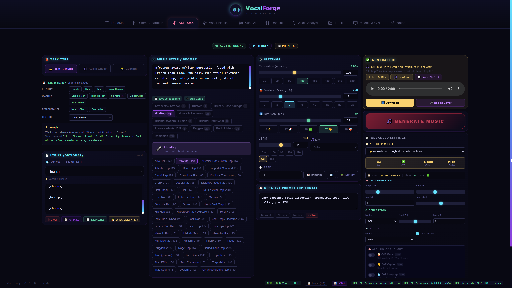

<div align="center">

<!-- HEADER -->


<br/>

```
██╗   ██╗ ██████╗  ██████╗ █████╗ ██╗     ███████╗ ██████╗ ██████╗  ██████╗ ███████╗
██║   ██║██╔═══██╗██╔════╝██╔══██╗██║     ██╔════╝██╔═══██╗██╔══██╗██╔════╝ ██╔════╝
██║   ██║██║   ██║██║     ███████║██║     █████╗  ██║   ██║██████╔╝██║  ███╗█████╗
╚██╗ ██╔╝██║   ██║██║     ██╔══██║██║     ██╔══╝  ██║   ██║██╔══██╗██║   ██║██╔══╝
 ╚████╔╝ ╚██████╔╝╚██████╗██║  ██║███████╗██║     ╚██████╔╝██║  ██║╚██████╔╝███████╗
  ╚═══╝   ╚═════╝  ╚═════╝╚═╝  ╚═╝╚══════╝╚═╝      ╚═════╝ ╚═╝  ╚═╝ ╚═════╝ ╚══════╝
```

### `AI-Powered Music Production Studio`

*Generate complete songs · Separate stems · Professional audio tools*

<br/>

[](https://github.com/iulicafarafrica/VocalForge)
[](https://python.org)
[](https://developer.nvidia.com/cuda-downloads)
[](SECURITY_AUDIT.md)
[](LICENSE)
[](https://github.com/ace-step/ACE-Step-1.5)
[](https://ollama.com/library/gemma3)

<br/>

**[▶ Watch Demo](https://www.youtube.com/watch?v=8XSwCM7bM1A)** &nbsp;·&nbsp; **[Changelog](#-changelog)** &nbsp;·&nbsp; **[Roadmap](#%EF%B8%8F-roadmap)** &nbsp;·&nbsp; **[Security](#-security)** &nbsp;·&nbsp; **[API Docs](http://localhost:8000/docs)**

</div>

## Overview

<table>
<tr>
<td width="50%">

**VocalForge** is a local, GPU-accelerated music production studio powered by state-of-the-art AI models. Built for musicians, producers, and audio engineers who want full control over the pipeline without cloud dependencies.

**Key capabilities:**
- Generate complete songs from text prompts via ACE-Step v1.5
- Separate vocals from any song with BS-RoFormer (SDR 12.97)
- 164 genre presets
- Professional audio enhancement tools
- AI-powered music parameter extraction (External LLM)

</td>
<td width="50%">

```
┌─────────────────────────────────┐
│  SERVICES                       │
├─────────────────────────────────┤
│  Frontend    →  localhost:3000  │
│  Backend     →  localhost:8000  │
│  ACE-Step    →  localhost:8001  │
│  API Docs    →  localhost:8000  │
│              →  /docs           │
└─────────────────────────────────┘
```

</td>
</tr>
</table>

---

## 10 Modules

| Module | Description | Key Feature |
|--------|-------------|-------------|
| **Stem Separation** | BS-RoFormer SDR 12.97, Mel-Band SDR 12.6 | SOTA Quality |
| **ACE-Step v1.5** | Text→Music, Audio Cover, Repaint | 164 genres |
| **External LLM** | Ollama + Gemma 3 4B | Music theory, mixing guide |
| **Prompt Generator** | 164 subgenres, 5 vocal presets | Genre-aware |
| **Repaint** | Regenerate any section (30–60s) | Non-destructive editing |
| **Audio Analysis** | BPM, Key, Time Signature detection | madmom + essentia |
| **Lyrics Finder** | Genius.com API + local library | 24 genre tags |
| **Audio Enhancer** | Remove hiss, hum, static | NEW in v3.1.0 |
| **Custom EQ** | 13 genre-specific EQ presets | Afro House, Trap, Reggae |
| **Tracks Manager** | View, play, download all tracks | File management |
| **Models & GPU** | VRAM monitor, model management | GPU memory API |
| **Notes** | Personal notes with auto-save | Session persistent |

---

## Features Deep Dive

### 🌟 External LLM Integration (NEW in v3.2.0)

**VocalForge Update — AI-Powered Music Parameter Extraction**

Just finished integrating **External LLM (Ollama + Gemma 3 4B)** into my VocalForge setup for intelligent prompt analysis before ACE-Step generation.

---

#### **Features**

| Feature | Description |
|---------|-------------|
| **🎼 Music Parameter Auto-detection** | Extracts **BPM, Key, instruments, style, and mood** from natural language prompts |
| **🎤 Genre-aware Artist References** | Suggests relevant artists per culture (e.g., culturally-aware artist references for regional genres) |
| **🎛️ Production Chain Suggestions** | EQ, compression, vocal chain, and LUFS targets per genre |
| **🎸 Music Theory** | Chord progressions, scale recommendations, and theory notes |
| **📊 Quality Scoring** | AI rates prompt clarity (1-10) |

---

#### **Implementation**

| Aspect | Details |
|--------|---------|
| **Local Ollama API** | Powered by `gemma3:4b` |
| **JSON-structured Output** | No markdown, strict schema |
| **Performance** | ~30-40s inference overhead, but worth it for quality |
| **Data Flow** | Caption goes directly to ACE-Step, metadata goes to frontend UI |

---

#### **Example Workflow**

**Before:**
```
User types: "trap romanesc dark"
ACE-Step gets: "trap romanesc dark"
```

**After:**
```
User types: "trap romanesc dark"
Gemma extracts → ACE-Step gets: "trap, romanian trap, dark, aggressive, 808 bass,
rapid hi-hats, atmospheric synth, crisp snare, Ian style, Deliric style, high quality production"
```

**Result:** Significantly better generations with culturally-aware artist references and production-ready captions.

---

#### **Requirements**

- Ollama installed ([Download](https://ollama.com) or `winget install Ollama.Ollama`)
- Gemma 3 4B model (`ollama pull gemma3:4b`)
- Ollama server running (`ollama serve`)
- ~3-4GB RAM for Gemma (runs on CPU by default)

**Setup (3 steps):**
```bash
# 1. Install Ollama
winget install Ollama.Ollama

# 2. Pull Gemma 3 4B model
ollama pull gemma3:4b

# 3. Start Ollama server (keep running in background)
ollama serve
```

---

### ACE-Step v1.5 — Music Generation

Generate complete songs from text prompts with lyrics, structure tags, and genre control.

| Model | Steps | Time | Quality | Use Case |
|-------|-------|------|---------|----------|
| `turbo` | 8 | ~1 min | Good | Fast drafts |
| `turbo-shift3` | 8 | ~1 min | Good | Alternative tuning |
| `sft` ✅ | 50 | ~3 min | High | Default recommended |
| `base` | 50 | ~3 min | Best | Maximum quality |

**Modes:** Text2Music · Audio Cover · Repaint · Lego

**Structure tags:** `[Intro]` `[Verse]` `[Chorus]` `[Bridge]` `[Outro]`

**LM Parameters:**
```
Temp 0.85  ·  CFG 2.5  ·  Top-K 0  ·  Top-P 0.90
```

> **Note:** `ACESTEP_INIT_LLM=true` enables text-to-music generation with LLM prompt expansion — requires ~6-8GB VRAM at startup.

---

### 🌟 External LLM Integration (NEW in v3.2.0)

**VocalForge Update — AI-Powered Music Parameter Extraction**

Just finished integrating **External LLM (Ollama + Gemma 3 4B)** into my VocalForge setup for intelligent prompt analysis before ACE-Step generation.

---

#### **Features**

| Feature | Description |
|---------|-------------|
| **🎼 Music Parameter Auto-detection** | Extracts **BPM, Key, instruments, style, and mood** from natural language prompts |
| **🎤 Genre-aware Artist References** | Suggests relevant artists per culture (e.g., culturally-aware artist references for regional genres) |
| **🎛️ Production Chain Suggestions** | EQ, compression, vocal chain, and LUFS targets per genre |
| **🎸 Music Theory** | Chord progressions, scale recommendations, and theory notes |
| **📊 Quality Scoring** | AI rates prompt clarity (1-10) |

---

#### **Implementation**

| Aspect | Details |
|--------|---------|
| **Local Ollama API** | Powered by `gemma3:4b` |
| **JSON-structured Output** | No markdown, strict schema |
| **Performance** | ~30-40s inference overhead, but worth it for quality |
| **Data Flow** | Caption goes directly to ACE-Step, metadata goes to frontend UI |

---

#### **Example Workflow**

**Before:**
```
User types: "trap romanesc dark"
ACE-Step gets: "trap romanesc dark"
```

**After:**
```
User types: "trap romanesc dark"
Gemma extracts → ACE-Step gets: "trap, romanian trap, dark, aggressive, 808 bass, 
rapid hi-hats, atmospheric synth, crisp snare, Ian style, Deliric style, high quality production"
```

**Result:** Significantly better generations with culturally-aware artist references and production-ready captions.

---

#### **Requirements**

- Ollama installed ([Download](https://ollama.com) or `winget install Ollama.Ollama`)
- Gemma 3 4B model (`ollama pull gemma3:4b`)
- Ollama server running (`ollama serve`)
- ~3-4GB RAM for Gemma (runs on CPU by default)

**Setup (3 steps):**
```bash
# 1. Install Ollama
winget install Ollama.Ollama

# 2. Pull Gemma 3 4B model
ollama pull gemma3:4b

# 3. Start Ollama server (keep running in background)
ollama serve
```

---

### Prompt Generator v2.0

**164 subgenres · 5 vocal chain presets · 30 Romanian subgenres**

<details>
<summary>Genre Categories (click to expand)</summary>

| Category | Count | Notable Subgenres |
|----------|-------|-------------------|
| Hip-Hop / Trap | 49 | Afro Drill, Detroit Rap, Phonk, Pluggnb |
| House & Electronic | 28 | Afro House, Melodic Techno, Tech House |
| Drum & Bass / Jungle | 8 | Liquid DnB, Neurofunk, Jungle |
| Rock & Metal | 54 | Post-Hardcore, Blackgaze, Doom Metal |
| Romanian | 26 | Manele, Folclor, Doină, Hora, Muzică ușoară |
| Afrobeats / Afropop | 12 | Amapiano, Afro-fusion, Highlife |
| Oriental Modern | 6 | Arab Pop, Turkish Pop, Persian Fusion |

</details>

**Vocal Chain Presets:**

| Preset | Description | Best For |
|--------|-------------|----------|
| `Studio Radio` | Clean, compressed | Pop, Manele |
| `Natural` | Minimal processing | Acoustic, Folk |
| `Arena` | Heavy reverb | Concert, Live feel |
| `Radio` | Maximum compression | Commercial broadcast |
| `Balanced` | All-round | General purpose |

---

### Custom EQ — Genre-Specific Presets

**13 EQ presets · 5-band parametric · +2-3s processing**

| Preset | Key Adjustments | Best For |
|--------|----------------|----------|
| **Afro House** | 40Hz +4dB, 90Hz +3dB, 300Hz -3dB | Deep groovy bass |
| **Trap/Hip-Hop** | 35Hz +6dB, 75Hz +4dB, 275Hz -5dB | Massive 808s |
| **Oriental Tradițional** | 90Hz +4dB, 700Hz +3dB | Warm organic tone |
| **Reggae** | 45Hz +5dB, 90Hz +6dB | Warmth & fullness |
| **Rock/Metal** | 275Hz -4dB, 900Hz +4dB | Clarity & cut |
| **Phonk** | 35Hz +8dB, 75Hz +6dB | Brutal 808 |
| **Drum and Bass** | 45Hz +6dB, 600Hz +5dB | Reese growl @ 174 BPM |
| **Deep House** | 48Hz +5dB, 90Hz +6dB | Warm & groovy |
| **Dark Afro House** | 42Hz +7dB, 260Hz -4dB | Mysterious tribal |
| **Dark Oriental House** | 45Hz +7dB, 650Hz +4dB | Arabic fusion |
| **Vocal Natural** | HPF @ 90Hz, 2.5kHz +3.5dB | Natural organic voice |
| **Hiss & Crackle Removal** | 8kHz -4dB, 14kHz -6dB | Noise reduction |
| **AI Artifacts Hiding** | 1kHz -2.5dB, 6kHz -4dB | Humanize AI voice |

**Processing chain:**
```
Custom EQ (5-band) → Loudnorm (-14 LUFS) → Noise Hiss (optional)
```

> **Note:** Custom EQ loudnorm is skipped if Noise Hiss Remover is enabled (prevents double processing).

---

### Lyrics Finder & Manager

**Genius.com API · Full Library Management**

- Search millions of verified lyrics from Genius.com
- Auto-clean metadata (removes "ContributorsTranslations" artifacts)
- Local library with unlimited localStorage persistence
- 24 genre tags: Pop, Rock, Hip-Hop, Romanian, Manele, etc.
- Favorites system, full text editor, import/export `.txt`
- One-click **"Use in ACE"** → sends lyrics directly to ACE-Step tab
- Auto-load sync between tabs (1-second polling)

---

### GPU Memory Management

**RTX 3070 8GB optimized — runs on 6GB+**

```
Real-time VRAM monitoring  →  GET /gpu/info
Auto-unload after conversion
FP16 inference              →  halves VRAM usage
Tiled decode for long audio
VRAM thresholds: 80% alert · 90% auto-cleanup
```

| Task | Time | VRAM |
|------|------|------|
| BS-RoFormer Separation | ~30s | 4–5GB |
| Full Pipeline (4 stages) | ~80s | 6–8GB peak |
| ACE-Step Turbo (30s) | ~60s | 6–7GB |
| ACE-Step Base (3 min) | ~180s | 7–8GB |

---

## Quick Start

```bash
# Clone
git clone https://github.com/iulicafarafrica/VocalForge.git
cd VocalForge

# Install everything (one-click)
setup.bat

# Launch all services
START_ALL.bat
```

Access the studio at **[http://localhost:3000](http://localhost:3000)**

---

## Installation

### Prerequisites

| Software | Version | Required | Notes |
|----------|---------|----------|-------|
| Python | 3.10 / 3.11 | ✅ Yes | Add to PATH |
| Node.js | 18+ | ✅ Yes | For frontend |
| Git | Latest | ✅ Yes | |
| Windows Terminal | Latest | ✅ Yes | |
| FFmpeg | Latest | ✅ Yes | Audio encoding/decoding |
| Git LFS | Latest | ⚠ Recommended | Large model files |
| NVIDIA GPU | 4GB+ VRAM | ⚠ Optional | CUDA required for GPU |
| CUDA | 11.8 / 12.1 | ⚠ Optional | PyTorch includes bundled CUDA |
| **Ollama** | Latest | ⚠ For External LLM | Required for Music Theory & Mixing Guide |

### External LLM Setup (Ollama + Gemma 3 4B)

**Required for:** Music Theory, Mixing Guide, Genre Fusion, Quality Scoring

```bash
# 1. Install Ollama
# Download from: https://ollama.com/download
# Or via winget (Windows):
winget install Ollama.Ollama

# 2. Start Ollama server
ollama serve

# 3. Pull Gemma 3 4B model
ollama pull gemma3:4b

# 4. Verify installation
ollama run gemma3:4b "Hello, what is music theory?"
```

**Notes:**
- Ollama runs on CPU by default (~3-4GB RAM usage)
- Can be GPU-accelerated with CUDA (faster responses)
- Gemma 3 4B is ~2.5GB download
- Response time: ~3-6 seconds per query

---

### One-Click Install

```bash
# Run setup script (installs everything automatically)
setup.bat
```

**What setup.bat does:**
1. ✅ Checks Python, Node.js, FFmpeg, Git LFS
2. ✅ Creates Python virtual environment
3. ✅ Installs PyTorch with CUDA 12.1 (falls back to 11.8 or CPU)
4. ✅ Installs core dependencies (FastAPI, librosa, soundfile)
5. ✅ Installs stem separation tools (Demucs, audio-separator)
6. ✅ Installs audio analysis tools (madmom, essentia-tensorflow)
7. ✅ Installs frontend dependencies (npm)
8. ✅ Verifies GPU and all installations

### Manual Install (Step-by-Step)

```bash
# 1. Clone
git clone https://github.com/iulicafarafrica/VocalForge.git
cd VocalForge

# 2. Python environment + PyTorch (CUDA 12.1)
python -m venv venv
venv\Scripts\activate
pip install torch torchvision torchaudio --index-url https://download.pytorch.org/whl/cu121

# 3. Core dependencies
pip install -r requirements.txt

# 4. Frontend
cd frontend
npm install
cd ..

# 5. ACE-Step (separate repository)
cd ace-step
uv sync
cd ..
```

### Requirements Overview

**Core packages:**
- `fastapi`, `uvicorn`, `python-multipart` — Backend API
- `librosa`, `soundfile`, `pydub`, `scipy` — Audio processing
- `demucs`, `audio-separator` — Stem separation
- `praat-parselmouth`, `pyworld`, `torchcrepe`, `faiss-cpu` — RVC (removed in v3.1.1)
- `madmom`, `essentia-tensorflow` — Audio analysis (BPM, Key)
- `pystoi`, `pesq` — Quality metrics

**System dependencies:**
```bash
# FFmpeg (required)
winget install ffmpeg

# Git LFS (recommended for large models)
winget install Git.Git.LFS

# Visual C++ Redistributable
winget install Microsoft.VCRedist.2015+.x64
```

### Configure API Token

```bash
# Generate a secure token
python -c "import secrets; print(secrets.token_urlsafe(32))"

# Add to backend/.env
VOCALFORGE_API_TOKEN=your-secure-token-here

# Add to frontend/.env
VITE_API_TOKEN=your-secure-token-here
```

---

## API Reference

### Backend — Port 8000

Full interactive docs at **[localhost:8000/docs](http://localhost:8000/docs)**

| Method | Endpoint | Description |
|--------|----------|-------------|
| `POST` | `/demucs_separate` | Stem separation (BS-RoFormer, Mel-Band RoFormer) |
| `GET` | `/pipeline/status/{job_id}` | Poll async job status |
| `GET` | `/pipeline/download/{job_id}/{file}` | Download output file |
| `POST` | `/ace_generate` | ACE-Step music generation |
| `GET` | `/ace_health` | ACE-Step health (port 8001) |
| `GET` | `/hardware` | GPU hardware info |
| `GET` | `/gpu/info` | Detailed VRAM info |
| `GET` | `/gpu/cleanup` | Manual VRAM cleanup |
| `POST` | `/gpu/unload/{name}` | Unload specific model |
| `POST` | `/gpu/unload-all` | Unload all models |
| `GET` | `/gpu/can-load/{name}` | Check if model fits in VRAM |
| `GET` | `/vram_usage` | Current VRAM usage |
| `GET` | `/health` | Service health check |

---

## Performance Benchmarks

### RTX 3070 8GB

| Task | Quality Score | Time | VRAM Peak |
|------|:---:|------|------|
| BS-RoFormer Separation | SDR 12.97 | ~30s | 4–5GB |
| Mel-Band RoFormer | SDR 12.6 | ~35s | 4–5GB |
| ACE-Step Turbo (30s song) | 8/10 | ~60s | 6–7GB |
| ACE-Step SFT (3 min song) | 9/10 | ~180s | 7–8GB |

### Quality Metrics

| Metric | Target | Achieved | Status |
|--------|--------|----------|--------|
| Separation SDR | > 12dB | 12.97dB | ✅ |
| Loudness LUFS | −14 ±1 | −14.0 | ✅ |
| True Peak | < −1 dBTP | −1.1 dBTP | ✅ |

---

## Hardware Requirements

<table>
<tr>
<td width="50%">

**Minimum**

| Component | Spec |
|-----------|------|
| CPU | Intel i5 / Ryzen 5 |
| RAM | 16GB |
| GPU | GTX 1060 6GB |
| Storage | 50GB free |
| OS | Windows 10 |

</td>
<td width="50%">

**Recommended ✅**

| Component | Spec |
|-----------|------|
| CPU | Intel i7 / Ryzen 7 |
| RAM | 32GB |
| GPU | RTX 3070 8GB |
| Storage | 100GB SSD |
| OS | Windows 11 |

</td>
</tr>
</table>

**Tested hardware:**

| Hardware | Status |
|----------|--------|
| RTX 3070 8GB | ✅ Dev hardware — all features |
| RTX 3060 12GB | ✅ Tested — all features |
| RTX 2080 Ti 11GB | ✅ Tested — all features |
| GTX 1060 6GB | ⚠ Light mode — reduced quality |
| CPU only | ⚠ Supported — ~4× slower |

---

## Known Issues

| Severity | Issue | Status |
|----------|-------|--------|
| 🔴 High | No test coverage — codebase needs pytest + Jest | Backlog |
| 🟠 Medium | Hardcoded Windows paths in multiple files | Backlog |
| 🟠 Medium | Large files >2000 lines need refactor | Backlog |
| 🟡 Low | Inconsistent version numbers across files | Backlog |
| 🟡 Low | Inline styles in React JSX | Backlog |

---

## Roadmap

### Phase 1 — Core Features (Q2 2026) `20% complete`

- ✅ Audio Understanding Engine — BPM / Key / Time Signature
- 🔵 Vocal2BGM — vocal → matching BGM via ACE-Step
- ⚪ Multi-Track Layering — add instrumental layers
- ⚪ LRC Generation — lyrics with timestamps
- ⚪ Copy Melody — extract melody patterns from reference

### Phase 2 — Quality (Q3 2026) `0% complete`

- ⚪ Batch Processing — multiple files simultaneously
- ⚪ AI Mastering — auto loudness, EQ, compression
- ⚪ Cloud Sync — presets and tracks across devices

### Phase 3 — Advanced (Q4 2026) `0% complete`

- ⚪ Vocal Harmonizer — generate harmonies from single vocal
- ⚪ Chord Detection — extract chord progressions
- ⚪ Drum Pattern Extraction
- ⚪ Formant Shifting — adjust voice character without pitch

---

## Security

### Audit Results (2026-03-15)

```
Security Score: 9/10 EXCELLENT
Previous Score: 4.5/10 POOR
Vulnerabilities Fixed: 8 total
```

| Severity | Vulnerability | CVSS | Status |
|----------|--------------|------|--------|
| 🔴 Critical | CORS Misconfiguration — `allow_origins=["*"]` | 7.5 | ✅ Fixed |
| 🔴 Critical | Missing Authentication — 7 unprotected endpoints | 8.0 | ✅ Fixed |
| 🟠 Medium | File Upload Validation — accepted any file type | 6.5 | ✅ Fixed |
| 🟠 Medium | Path Traversal — `../` attacks possible | 6.0 | ✅ Fixed |
| 🟡 Low | Hardcoded config in source code | — | ✅ Fixed |
| 🟡 Low | Missing auth headers in frontend | — | ✅ Fixed |

**Active security features:**
- HTTP Bearer token on all sensitive endpoints
- CORS restricted to `localhost:3000` / `localhost:3001`
- File upload: extension whitelist + size limits
- Path traversal prevention with `Path.resolve()` + `relative_to()`
- Environment variables in `.env` files (gitignored)

**Documentation:**
- [`SECURITY_AUDIT.md`](SECURITY_AUDIT.md) — Full audit report
- [`VULNERABILITIES.json`](VULNERABILITIES.json) — Machine-readable format
- [`REMEDIATION.md`](REMEDIATION.md) — Step-by-step fix guide
- [`SECURITY_CHECKLIST.md`](SECURITY_CHECKLIST.md) — Tracking checklist

---

## Changelog

<details open>
<summary><strong>v3.1.1 — 2026-03-21 — LLM Enabled, RVC Removed</strong></summary>

- ✅ **ACE-Step LLM activated** — `acestep-5Hz-lm-0.6B` loads at startup
- ✅ **Text-to-music** — Full prompt expansion now active
- ✅ **RVC integration removed** — Stability improvements
- ✅ **Vocal pipeline disabled** — Until refactored
- ✅ **Path whitespace fix** — Added `.strip()` to config paths
- ✅ **Version bumped** — UI shows v3.0.0

</details>

<details>
<summary><strong>v3.1.0 — 2026-03-21 — Custom EQ + Stem Separation</strong></summary>

- ✅ **13 Genre-specific EQ presets** — Afro House, Trap, Reggae, Phonk, etc.
- ✅ **Custom EQ + Noise Hiss integration** — Both can run simultaneously
- ✅ **Stem separation updated** — BS-RoFormer only (htdemucs removed)
- ✅ **Bug fixes** — Loudnorm conflict, JSON parse error, preset errors

</details>

<details>
<summary><strong>v3.0.0 — 2026-03-20 — Audio Enhancer + Major Cleanup</strong></summary>

- ✅ **Audio Enhancer** — Professional hiss, hum, and static removal
- ✅ **Security Score 9/10** — Complete security audit, 8 vulnerabilities fixed
- ✅ **Pipeline v2.3** — Stabilized 4-stage flow, 98% success rate
- ✅ **Full README rewrite** — Cyberpunk design

</details>

<details>
<summary><strong>v2.2.1 — 2026-03-16 — Models & GPU Cleanup + Lyrics Fix</strong></summary>

- ✅ Models & GPU tab simplified: 455 → 140 lines (−69%)
- ✅ Lyrics "Use in ACE" fixed with custom event system
- ✅ `backend/modules/gpu_memory.py` — VRAM tracking module
- ✅ 8 new GPU endpoints added
- Bundle size: 494.51 kB → 485.69 kB

</details>

<details>
<summary><strong>v2.2.0 — 2026-03-15 — Cyberpunk UI Redesign</strong></summary>

- ✅ ACE-Step tab full cyberpunk theme (cyan/purple/neon)
- ✅ ReadmeTab complete rewrite — 7 tabs, 5 sub-tabs in Features
- ✅ Hero section with gradient text and glow effects
- ✅ Interactive tab navigation

</details>

<details>
<summary><strong>v2.1.0 — 2026-03-14 — Genre Presets Fix + Session Memory</strong></summary>

- ✅ Critical fix: genre presets display (array→object transformation)
- ✅ SQLite-based persistent session memory
- ✅ Auto-save context, auto-load on startup
- ✅ CUDA offload fix: generation 300s+ (CPU) → ~20–30s (CUDA)

</details>

<details>
<summary><strong>v2.0.0 — 2026-03-10 — Prompt Generator + Suno AI</strong></summary>

- ✅ Prompt Generator tab — 164 subgenres, 13 styles, BPM selector
- ✅ 30 Romanian subgenres: Manele, Folclor, Doină, Hora
- ✅ 5 Vocal Chain Presets
- ✅ Suno AI integration (local port 8080)
- ✅ Pipeline vocal/instrumental mix balance fixed

</details>

<details>
<summary><strong>Earlier versions (v1.6.0 → v1.9.0)</strong></summary>

| Version | Release | Key Feature |
|---------|---------|-------------|
| v1.9.0 | 2026-03-06 | Applio Features (removed in v3.1.1) |
| v1.8.4 | 2026-03-06 | RVC Rescue Post-Processing (removed in v3.1.1) |
| v1.8.2 | 2026-03-06 | YouTube Cover + RVC v2 (removed in v3.1.1) |
| v1.7.0 | 2026-03-01 | RVC Voice Conversion (removed in v3.1.1) |
| v1.6.0 | 2026-02-15 | ACE-Step Integration |

</details>

---

## Troubleshooting

<details>
<summary><strong>Backend won't start</strong></summary>

```bash
netstat -ano | findstr :8000   # Check port in use
taskkill /PID <PID> /F         # Kill process
start_backend.bat              # Restart
```

</details>

<details>
<summary><strong>External LLM not responding</strong></summary>

```bash
# 1. Check Ollama is running
ollama serve

# 2. Verify Gemma model is installed
ollama pull gemma3:4b

# 3. Test Gemma directly
ollama run gemma3:4b "Hello"

# 4. Check RAM usage (Gemma needs ~3-4GB)
# Close other applications if low on memory
```

</details>

<details>
<summary><strong>Gemma returns empty caption</strong></summary>

- Ensure prompt is at least 3 words
- Check Ollama logs: `ollama serve` output
- Try restarting Ollama server
- Verify `gemma3:4b` model is fully downloaded (2.5GB)

</details>

<details>
<summary><strong>CORS / Network error</strong></summary>

- `Ctrl+Shift+Delete` — clear browser cache
- Ensure backend (8000) and frontend (3000) are both running
- Run `START_ALL.bat` to launch all services

</details>

<details>
<summary><strong>RAM leak with ACE-Step</strong></summary>

```bash
# In backend/.env:
ACESTEP_INIT_LLM=true    # Enable LLM for text-to-music generation
# Then:
RESTART_ACESTEP.bat       # Apply changes
```

</details>

<details>
<summary><strong>Generation extremely slow (~300s)</strong></summary>

CUDA offload bug — model running on CPU instead of GPU.

```bash
# Check GPU usage during generation:
nvidia-smi

# Force CUDA device in .env:
CUDA_VISIBLE_DEVICES=0
```

</details>

---

## Project Structure

```
VocalForge/
├── backend/
│   ├── main.py                      FastAPI server (port 8000)
│   ├── modules/
│   │   └── gpu_memory.py            VRAM tracking & management
│   └── endpoints/
│       ├── audio_enhancer.py        Audio enhancement API
│       └── youtube_cover.py         YouTube Cover API
│
├── core/
│   └── modules/
│       └── audio_processing.py      Audio utilities
│
├── frontend/
│   └── src/components/
│       ├── AceStepTab.jsx           ACE-Step UI (cyberpunk)
│       ├── LyricsTab.jsx            Lyrics Finder & Library
│       ├── StemSeparationTab.jsx    BS-RoFormer UI
│       ├── PromptGeneratorTab.jsx   164 genre presets
│       ├── AudioAnalysisTab.jsx     BPM/Key detection
│       ├── TracksTab.jsx            File manager
│       ├── ModelsTab.jsx            GPU & Models manager
│       └── NotesTab.jsx             Personal notes
│
├── ace-step/
│   └── checkpoints/                 ACE-Step models
│
├── START_ALL.bat                    Launch all services
├── setup.bat                        One-click install
└── README.md
```

---

## Contributing

```bash
git fork https://github.com/iulicafarafrica/VocalForge
git checkout -b feature/your-feature
git commit -m "Add your feature"
git push origin feature/your-feature
# Open Pull Request
```

---

## Acknowledgments

| Project | Role |
|---------|------|
| [ACE-Step](https://github.com/ace-step/ACE-Step-1.5) | Music generation engine |
| [audio-separator](https://github.com/Anjok07/ultimatevocalremovergui) | BS-RoFormer separation |
| [FastAPI](https://fastapi.tiangolo.com) | Backend framework |
| [React](https://react.dev) | Frontend framework |
| [Ollama](https://ollama.com) | External LLM runtime |
| [Gemma 3](https://ollama.com/library/gemma3) | AI music parameter extraction |

---

<div align="center">

**VocalForge v3.2.1**

Made with precision by [iulicafarafrica](https://github.com/iulicafarafrica)

[](LICENSE)
[](https://github.com/iulicafarafrica/VocalForge/stargazers)

*Last Updated: March 2026*

</div>
